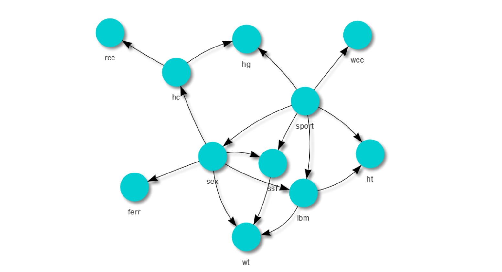
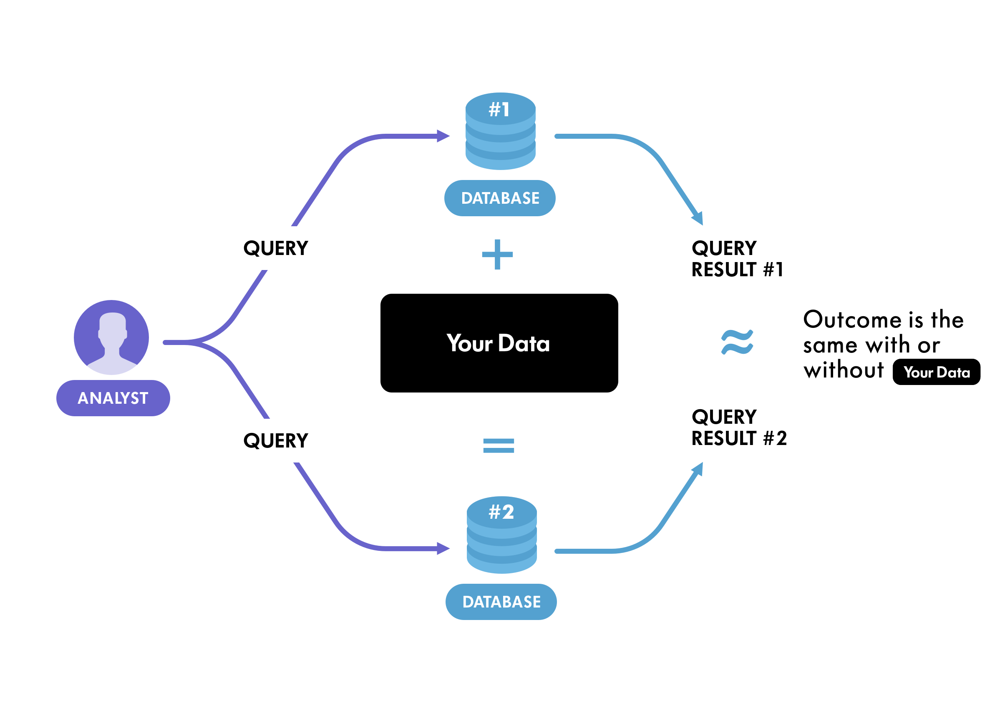

# Synthesizing-MIMIC-III-Data

Synthesizing MIMIC-III ICU data for project-based data science/engineering purposes.

Based on [DataSynthesizer](https://github.com/DataResponsibly/DataSynthesizer), this repository aims at generating synthetic data simulated from the [MIMIC III ICU data](https://physionet.org/content/mimiciii/1.4/). Given a CSV file with 60000 records roughly, we tend to:

- Investigate conditional dependency between variables using the Bayesian Network statistical graphical model.
- Apply [Differential Privacy standards](https://theconversation.com/explainer-what-is-differential-privacy-and-how-can-it-protect-your-data-90686) on clinical data.
- Generate synthesized data from a given input with a chosen number of records.

## The Ultimate Goal

Sharing sensitive and privacy-encumbered healthcare data is a huge concern with data owners and the increase of collaboration with data scientists, engineers and analysts become mandatory to create reports, capture insights from the data, build ML/DL model in clinical settings or even build data warehouses and data lakes. This repository tends to do the following:

- Automatically, detect causal relationship between clinical data attributes and their statistical properties with Bayesian Networks. This would help choose the appropriate `DataGenerator()` mood: "random", "correlated", or "independent"

- Generate synthetic healthcare data that preserve strong privacy guarantees to ensure that inclusion or exclusion of any data record will not affect or change the statistical properties of the original dataset ــ only adding random noise to alter values that won't significantly affect the original properties of MIMIC-III ICU data.

